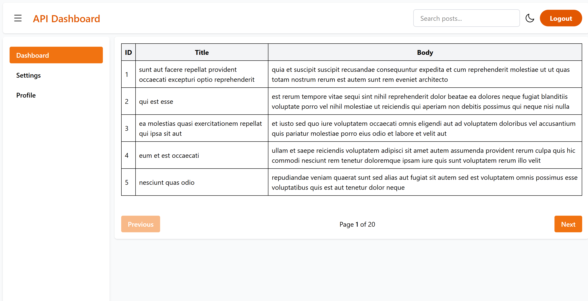
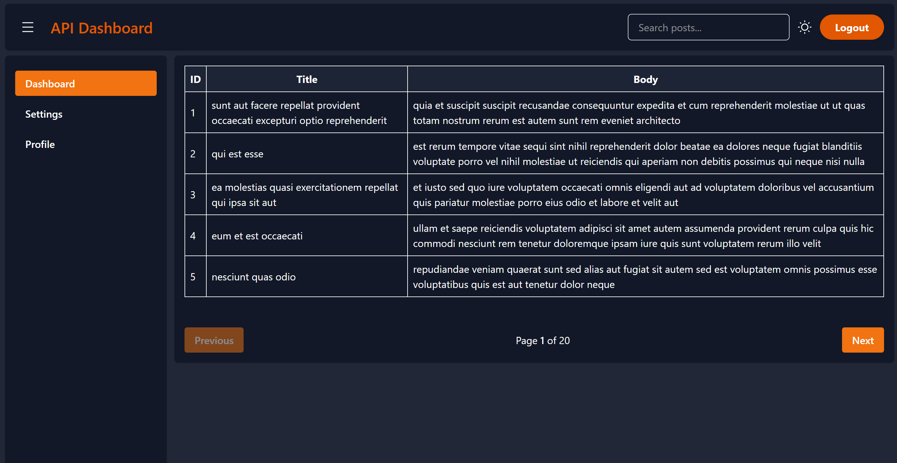
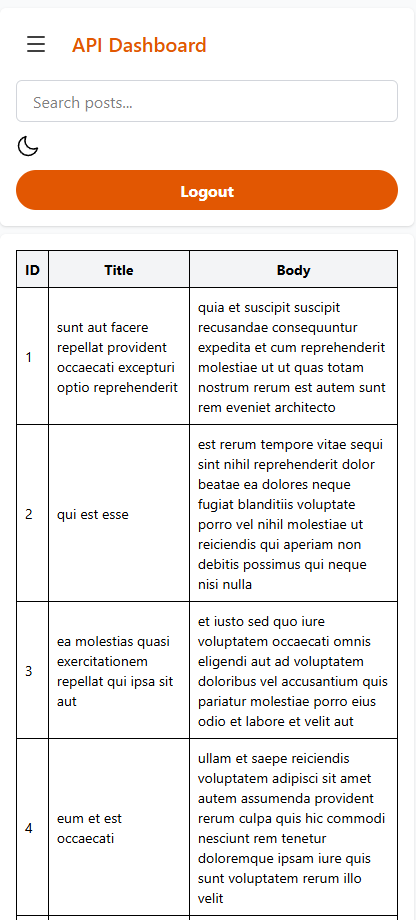

# API Dashboard

A **Next.js** project for tracking and visualizing API data.

---

## 📸 Screenshots

### 🏠 Home Page

### 🏠 Home Page Dark Theme

### 🏠 Home Page Mobile Screen

## 🚀 Project Setup

### 1. Clone the repository
git clone https://github.com/shelavalepallavi/api-dashboard

cd api-dashboard

2. Install dependencies
npm install

4. Run the development server
npm run dev
Visit http://localhost:3000 to view the app.

✅ Available Scripts

Command	Description

npm run dev	Start the app in development mode

npm run build	Build the app for production

npm start	Start the production build

🌐 Deployment

This project can be deployed on Vercel.

📁 Project Structure

api-dashboard/

├─ app/

├─ components/

├─ public/

├─ .gitignore

├─ package-lock.json

├─ package.json

└─ README.md

🙋‍♀️ Author

Pallavi Shelavale

GitHub: [shelavalepallavi](https://github.com/shelavalepallavi)

Portfolio: [pallavishelavale.github.io](https://shelavalepallavi.github.io/)

